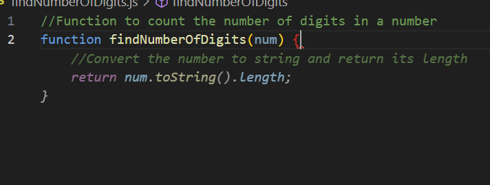
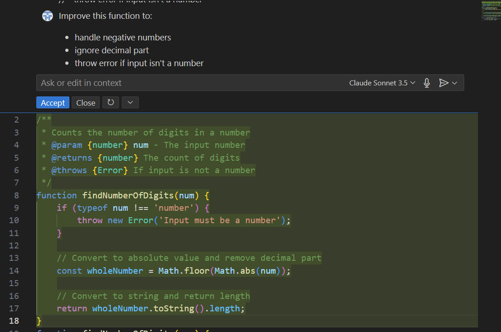
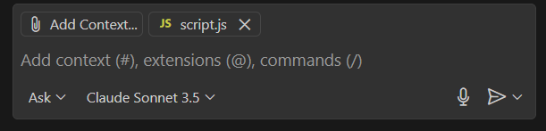
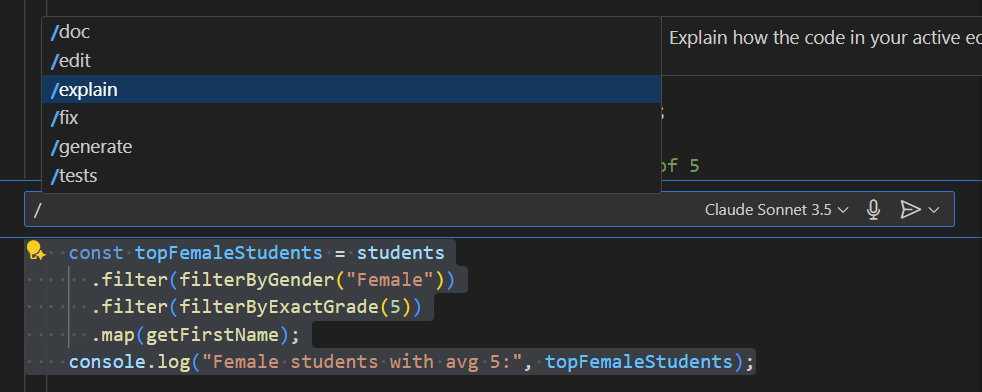
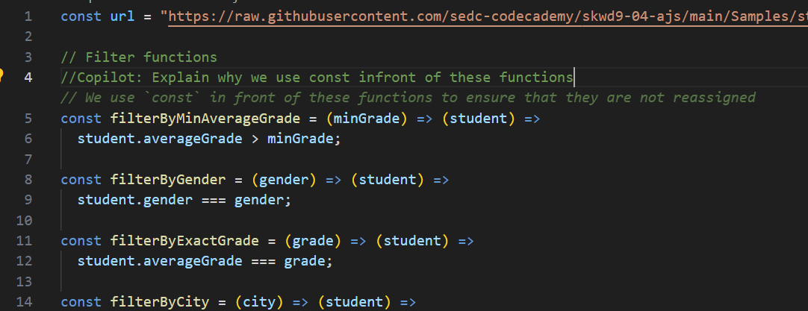
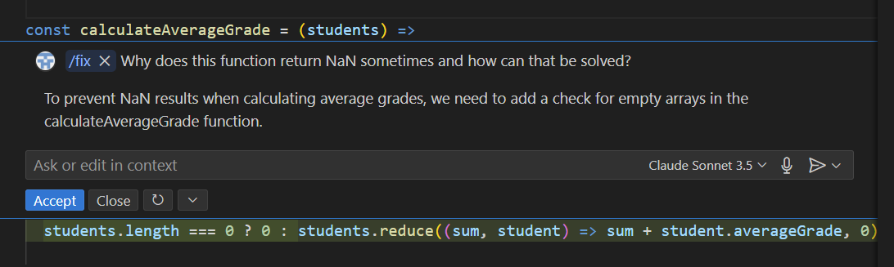
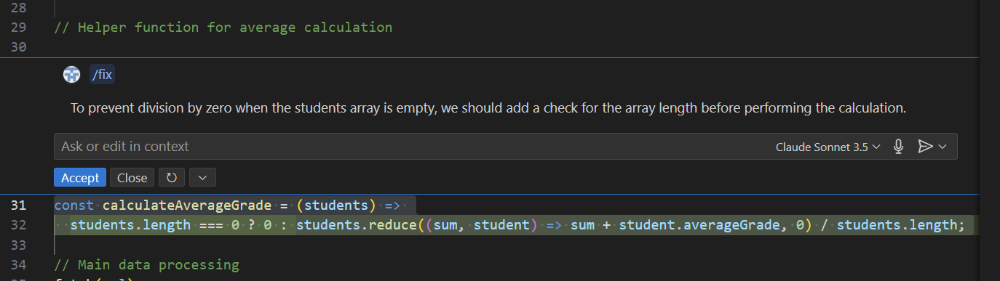
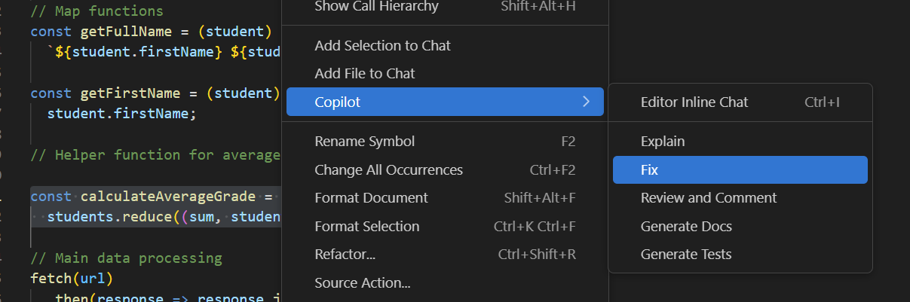
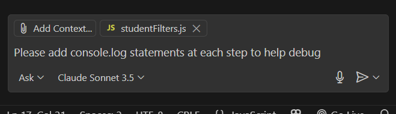
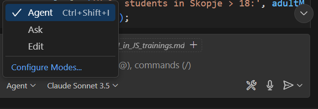

# Using Copilot in JavaScript Training

In our JavaScript sessions, we will show how **Copilot can assist students in writing boilerplate code, generating functions, refactoring, debugging and setting up small projects**.  
The goal is not to replace learning but to guide students toward **structured thinking and understanding** how code works.

---

## Example for producing boilerplate code: Random Color Page

We will start by exploring **how the quality of the prompt affects the output**. Even simple tasks can produce very different results depending on how we ask the question.

**Task:** <br>
`On every refresh, the page should pick a random color and change the background of the page; display RGB values in the center.`

**Reason:** Combines HTML + JavaScript; demonstrates a clear **boilerplate page setup** scenario.

### Example: Vague Prompt Output

**Prompt**
>Make a page that changes color.

**Sample answer**

``` html
<!DOCTYPE html>
<html lang="en">
<head>
    <meta charset="UTF-8">
    <title>Color Changing Page</title>
    <style>
        body {
            display: flex;
            justify-content: center;
            align-items: center;
            height: 100vh;
            margin: 0;
            font-family: Arial, sans-serif;
            transition: background-color 0.5s;
        }
        #colorInfo {
            padding: 20px;
            background: rgba(255, 255, 255, 0.2);
            border-radius: 8px;
            text-align: center;
        }
    </style>
</head>
<body>
    <div id="colorInfo">
        <h2>Current Color:</h2>
        <p id="colorDisplay"></p>
        <button onclick="changeColor()">Change Color</button>
    </div>

    <script>
        function changeColor() {
            const r = Math.floor(Math.random() * 256);
            const g = Math.floor(Math.random() * 256);
            const b = Math.floor(Math.random() * 256);
            
            document.body.style.backgroundColor = `rgb(${r}, ${g}, ${b})`;
            document.getElementById('colorDisplay').textContent = `RGB(${r}, ${g}, ${b})`;
        }

        // Initial color change
        changeColor();
    </script>
</body>
</html>
```

#### Analysis / Why this is not ideal

- **Slightly functional:** allows changing colors and shows RGB values.
- **Requires manual interaction:** click the button to see a new color—does not automatically refresh.
- **Partially satisfies the task:** works as a "color changer" but does not fully meet the requirement of automatic change on page load.
- **Vague prompts lead to incomplete output:** shows that AI cannot infer all requirements without specific instructions.
- **Structure is decent:** HTML and CSS are mostly correct, but functional gaps remain.


---


### Example: Detailed Prompt Output

**Prompt**
>Create an HTML page that changes background color to a random RGB color on every refresh, and displays the RGB values in the center of the page. Use proper HTML structure and clean JavaScript.

**Sample answer**

``` html
<!DOCTYPE html>
<html lang="en">
<head>
    <meta charset="UTF-8">
    <title>Color Changing Page</title>
    <style>
        body {
            display: flex;
            justify-content: center;
            align-items: center;
            height: 100vh;
            margin: 0;
            font-family: Arial, sans-serif;
            transition: background-color 0.5s;
        }
        #colorInfo {
            padding: 20px;
            background: rgba(255, 255, 255, 0.2);
            border-radius: 8px;
            text-align: center;
        }
    </style>
</head>
<body>
    <div id="colorInfo">
        <h2>Current Color:</h2>
        <p id="colorDisplay"></p>
        <button onclick="changeColor()">Change Color</button>
    </div>

    <script>
        function changeColor() {
            const r = Math.floor(Math.random() * 256);
            const g = Math.floor(Math.random() * 256);
            const b = Math.floor(Math.random() * 256);
            
            document.body.style.backgroundColor = `rgb(${r}, ${g}, ${b})`;
            document.getElementById('colorDisplay').textContent = `RGB(${r}, ${g}, ${b})`;
        }

        // Initial color change
        changeColor();
    </script>
</body>
</html>
```

Copilot provides additional explanation such as :
> ## To use this:
> - Create a new file named **index.html**  
> - Copy the code above into it  
> - Open in your browser and refresh to see different colors  
>
> ## Features:
> - Generates random RGB colors  
> - Centers the color display  
> - Uses semantic HTML structure  
> - Includes responsive design  
> - Has clean, organized JavaScript  
> - Provides visual feedback with semi-transparent display box 

#### Analysis / Why this is excellent

- Automatically generates a new random color on page load.
- Displays RGB values centrally.
- Clean HTML, CSS, and JS structure.
- Meets the prompt fully and demonstrates a complete boilerplate example combining HTML and JavaScript.

**Note:**
Questions for further explanation of the solution should follow. This way we are interacting with the AI assistant, not just accepting solutions it provides. For example:
- Why do we use Math.floor(Math.random() * 256) to generate RGB values?
- What would happen if we used Math.random() * 100 instead?
- Why is the updatePage() function called at the end of the script?

We can even ask questions for further extension:
- How would you modify the code so the background changes automatically every 2 seconds instead of on refresh?
- Can you add a button that lets the user copy the RGB value to the clipboard?
- Refactor this code so the color generation logic is in a separate utility function.
- Put the javascript code in a separate file.

---

## Using Copilot for code completition

In this section we want to show hoe Copilot can generate code if we give an appropriate comment and start typing code.

We have a task: <br>
`Write a function that takes a number as a parameter and returns the number of digits it has.` <br>

If we type a comment and hit `Tab` Copilot will start giving a suggestion for the function we need. If we continue accepting by using `Tab` it will complete the function. <br>

 <br>

You could accept the suggestion, but a trainer should guide students to analyze and test it before assuming it’s correct.

 <br>

Copilot can help us with code completion, but we must approach its suggestions carefully, analyzing them thoroughly and critically before using them.

---

## Using Copilot to Refactor JavaScript: Student Data Example

In this section we want to demonstrate how AI tools can help in code refactor.

We will have given the students the following exercise:
>There is a JSON file with students. Make a call to the file and get the following data from it:
>
>All students with an average grade higher than 3
All female student names with an average grade of 5
All male student full names who live in Skopje and are over 18 years old
The average grades of all female students over the age of 24
All male students with a name starting with B and average grade over 2
Use higher order functions to find the answers Link: https://raw.githubusercontent.com/sedc-codecademy/skwd9-04-ajs/main/Samples/students_v2.json`

For this exercise, we have a **prepared solution** stored in a folder called RefactorExample, including the HTML `index.html` and a `script.js` file. The `script.js` contains a working but unrefined solution for processing student data from a JSON file. We will come to the solution given in `script.js` together with the students.

Then, we will ask **Copilot** to help us **refactor the code**  to make it:

- More modular and reusable  
- Easier to read and maintain  
- Properly using **higher-order functions** (`filter`, `map`, `reduce`)  
- Ready for practical, real-world scenarios  

**Prompt**
>Refactor this student filtering code to make it more modular and readable. Create reusable functions for filtering and mapping students by criteria, and use meaningful variable names. Keep using HOFs.

**Note:** <br>
We use script.js file from the prepared folder as reference and ask Copilot to refactor the code. This way we show that we can give **context** to Copilot.
 <br>
**We say: Keeping the original higher-order functions intact. With this part we provide rules for Copilot.**

The refactored solution can be found in the studentFilters.js file.

> **Additional Explanation from Copilot**
>
> **Key improvements in this refactored version:**
>
> - **Reusable Filter Functions:** Created separate filter functions that can be composed for different criteria.
> - **Reusable Map Functions:** Extracted common mapping operations into named functions.
> - **Higher-Order Functions:** Each filter function returns another function, following functional programming principles.
> - **Meaningful Names:** Used descriptive variable and function names that clearly indicate their purpose.
> - **Consistent Structure:** Each operation follows a similar pattern of chaining filters and maps.
> - **Helper Function:** Extracted average calculation into a separate function for reusability.
>
> The code is now more:
>
> - **Maintainable:** Each function has a single responsibility
> - **Reusable:** Filter and map functions can be combined in different ways
> - **Readable:** Function names clearly describe their purpose
> - **Testable:** Individual functions can be tested in isolation
> - **Flexible:** Easy to add new filtering or mapping criteria

This example demonstrates how **AI can assist in code refactoring**, while the instructor guides students to **evaluate, improve, and understand** the generated code.

**Note:**
Further questions should follow here too, asking for explanation of the solution. For example:
- Why is it useful to separate filter functions (e.g., filterByGender, filterByMinAge) into reusable pieces?
- What advantage does having named mapping functions (like getFullName) bring compared to inline anonymous functions?
- How does the helper function calculateAverageGrade improve readability and maintainability?
- How would you modify the code so filterByNameStartsWith ignores case sensitivity?
- What happens if there are no female students over 24? Does the calculateAverageGrade function break? How could we handle that edge case?

### Using the explain command

Copilot supports different commands that we can use in order to give him instructions. One of the is the command `/explain`. We can hightlight a function, open the inline chat using `Ctrl + I` and enter the command. If we enter `/` it lists all the available commands.


## Debugging with Copilot: Trainer Script

The goal here is to show how Copilot can help debug and explain a refactored   solution given in (`studentFilters.js`). There are multiple ways we can use Copilot to help with debugging.

---

### Ask Copilot to Explain using comments

Add a comment in the js code starting with `Copilot:`, when you start typing, Copilot will give suggestions in a greyed out manner. You can accept by using `Tab`.



### Ask Copilot about an issue using the chat

#### Using inline chat
We can use the Copilot Chat tab or we can use the inline Copilot chat by pressing Ctrl + I. We can ask Copilot about a problem that we came across and ask him to give us a suggested solution and explain what was the issue. 



#### Using commands
We can use commands in Copilot to give explicit instructions. Commands are used with `/` infront. One of these commands is the fix command. We can highlight the code and use the inline chat to give the `/fix` command or right click and select **Copilot - Fix**. <br>
Using command: <br>

 <br>

Using right click: <br>



When we use the `/fix` command we can ask for a fix to a specific issue we have, or just use the command without further instructions and Copilot will try to add **guards** to the code that might fix potential issues.

#### Using chat to ask for logs
We can use the Copilot Chat tab to ask for logs. For example we want to ask for console.logs in the appropriate file we want to easily debug.



Or we can highlight code and use the inline chat to ask for these logs only in that part.

#### Use chat to ask for test cases
If we have an issue with a given function, we can hightlight the function, open inline chat and ask Copilot to generate small test cases with some mock objects for example and `console.assert` tests.

## Copilot Agent Mode

For more advanced coding tasks, especially for the advanced excersises, workshops and projects, Agent mode is the best tool to use in Copilot. Unlike the Ask feature, which only provides explanations or guidance, Agent mode can take action on your code directly. It can perform multi-step edits across functions or even multiple files, refactor code to handle edge cases, add logging to complex pipelines, generate unit tests for functions, and standardize code style across your project. This makes it ideal for advanced debugging, large refactors, and automating repetitive improvements, giving you a powerful way to manage and enhance your code efficiently. We can choose it from the dropdown like following:





